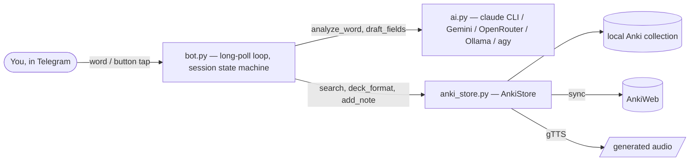

# anki-telegram

Telegram bot for German vocabulary. Send it a word; it checks your Anki
collection (via AnkiWeb sync) for existing cards — including other
forms/tenses and appearances inside other cards' example sentences — then
offers options: create a card that mirrors your target deck's format, write
the fields yourself, or skip. Cards get German TTS audio and are synced back
to AnkiWeb immediately.

Fully standalone: no Anki desktop, no AnkiConnect. Uses the official `anki`
Python library headlessly, plain `urllib` for Telegram and for AI HTTP
providers, and `gTTS` for audio. AI defaults to the
[Claude Code CLI](https://claude.com/claude-code) in headless mode
(`claude -p`), authenticated by your existing Claude subscription — no API
key needed. Set `AI_PROVIDER` to route through something else instead:
Gemini or OpenRouter (free-tier APIs), a local Ollama, or the
[Antigravity CLI](https://antigravity.google) (`agy`, authenticated by your
Google AI Pro/Ultra login — also no API key, and typically a more generous
quota than Claude/Gemini's own free/pro tiers, so it's worth switching to if
you're getting rate-limited).

## Flow

```
you: läuft
bot: laufen
     ✅ laufen — Languages::Deutsch::Goethe A1
     📝 in einkaufen (de_sentence) — Netzwerk B1
     [⭐ Skip — already exists] [Create card] [Write it myself] [Cancel]
```

Picking **Create card** drafts all fields with Claude, mirroring the note
type, formatting, and languages of real notes from your chosen target deck,
shows a preview, and saves on confirmation (with generated audio in the
deck's audio field, if it has one). The preview offers **Write it myself**
and **Edit fields** (prefilled with the draft) if you'd rather not keep it.

The whole thing — choice, deck pick if needed, preview, add/remove example —
plays out by editing a single message in place, so a chat with several words
in flight doesn't fill up with old button messages.

## Architecture



`ai.py` shells out to the **Claude Code CLI** (`claude -p --output-format
json`) rather than calling the Anthropic API directly — auth rides on the
user's existing Claude subscription, so there's no API key handling for the
default provider. `AnkiStore` wraps a headless `anki.collection.Collection`
(no Anki desktop, no AnkiConnect): full download is allowed before every
read but refused after a local write, so a forced full sync can never
silently discard a card the bot just created.

## Setup

Requires Python 3.13+, [uv](https://docs.astral.sh/uv/), and the
[Claude Code CLI](https://claude.com/claude-code):

```sh
npm install -g @anthropic-ai/claude-code
claude   # log in once with your Claude account, then exit
```

(On a machine where you can't log in interactively, run `claude setup-token`
elsewhere and put the token in `.env` as `CLAUDE_CODE_OAUTH_TOKEN`.)

```sh
uv sync
cp .env.example .env   # then fill in the values
```

`.env` values:

| Variable | Purpose |
|---|---|
| `TELEGRAM_BOT_TOKEN` | From [@BotFather](https://t.me/BotFather) |
| `TELEGRAM_CHAT_ID` | Your numeric user ID (from [@userinfobot](https://t.me/userinfobot)); all other chats are ignored |
| `ANKIWEB_USERNAME` / `ANKIWEB_PASSWORD` | AnkiWeb account for sync |
| `AI_PROVIDER` | Optional: `claude` (default), `gemini`, `openrouter`, `ollama`, or `agy` |
| `CLAUDE_CODE_OAUTH_TOKEN` | Optional — long-lived token from `claude setup-token` if the host isn't logged in |
| `CLAUDE_MODEL` | Optional, passed to `claude --model` (default `haiku`) |
| `CLAUDE_BIN` | Optional path to the `claude` binary (useful under systemd) |
| `GEMINI_API_KEY` / `GEMINI_MODEL` | Required if `AI_PROVIDER=gemini` — free key at [aistudio.google.com](https://aistudio.google.com/apikey) |
| `OPENROUTER_API_KEY` / `OPENROUTER_MODEL` | Required if `AI_PROVIDER=openrouter` — key at [openrouter.ai/keys](https://openrouter.ai/keys), many models have a free `:free` tier |
| `OLLAMA_HOST` / `OLLAMA_MODEL` | Used if `AI_PROVIDER=ollama` — local, no key, run `ollama pull <model>` first |
| `OLLAMA_API_KEY` | Optional, only for a remote/auth-protected Ollama or Ollama Cloud |
| `AGY_MODEL` | Optional, passed to `agy --model` if `AI_PROVIDER=agy` (default `Gemini 3.5 Flash (Medium)`) |
| `AGY_BIN` | Optional path to the `agy` binary (useful under systemd) — install from [antigravity.google](https://antigravity.google) |
| `DATA_DIR` | Optional, defaults to `./data` (local collection, media, state) |

## Run

```sh
uv run anki-telegram            # long-poll loop
uv run anki-telegram --once     # process pending updates and exit
```

First run performs a full download of your collection from AnkiWeb into
`DATA_DIR`. The bot syncs before every lookup and after every card it
creates, so it stays consistent with your other devices.

You can send several words before answering any of them — each gets its own
thread. When asked to write fields yourself, reply directly to that prompt
(tap it, then Reply) so the bot knows which word it's for.

## Commands

- `/deck` — pick the target deck for new cards (remembered across restarts)
- `/cancel` — reply to a word's message to abandon just that one, or send
  bare to abandon everything in flight
- `/help` — usage

## Deploy as a service

`anki-telegram.service` is a systemd user unit template:

```sh
mkdir -p ~/.config/systemd/user
cp anki-telegram.service ~/.config/systemd/user/
# edit WorkingDirectory/ExecStart paths if you cloned elsewhere
systemctl --user daemon-reload
systemctl --user enable --now anki-telegram
loginctl enable-linger "$USER"   # keep it running without an open session
```

## Tests

```sh
uv run python tests/test_helpers.py
```

## Notes

- Sync safety: after a card is written, the bot refuses full-sync
  resolutions (which could discard the new card) and asks you to resolve
  the conflict in Anki once — normal syncs then resume.
- The bot mirrors whatever note type a deck actually uses, so field names,
  languages, and formatting conventions come from your own notes, not from
  hardcoded templates.
